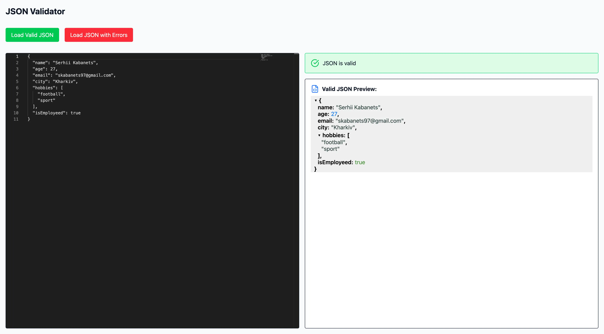

# JSON Validator

**A live JSON validation tool built with Monaco Editor, React, TypeScript, and Tailwind CSS.**  
Validate JSON syntax and schema in real-time with instant feedback and visual JSON preview.

## Features

- Monaco Editor with JSON syntax highlighting and auto layout
- Real-time JSON validation against a custom schema using AJV
- Detailed and user-friendly error reporting with visual icons
- JSON preview with collapsible tree structure (powered by react-json-view-lite)
- Fast development environment powered by Vite
- Clean, responsive UI with Tailwind CSS

## Tech Stack

- Vite
- React + TypeScript
- Monaco Editor (`react-monaco-editor`)
- AJV (JSON Schema Validator)
- Tailwind CSS
- react-json-view-lite
- lucide-react (for icons)

## Screenshots

